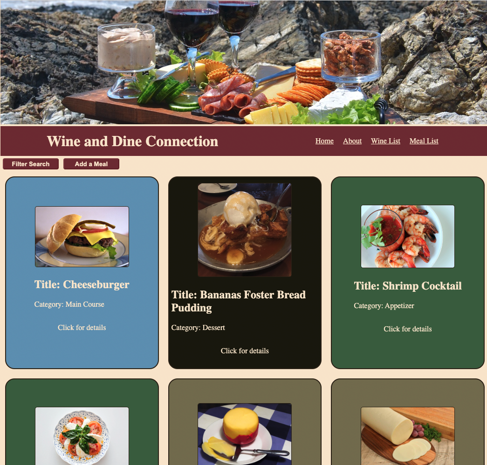

# Wine and Dine Connection

---

## Dates: 7/22/22 - 7/29/22

---

### **_Project Links_**

[Trello](https://trello.com/b/zuqdfUap/project-2-fullstack) | [deployment](https://morning-fjord-87128.herokuapp.com/)

### **_My Links_**

[LinkedIn](https://www.linkedin.com/in/patrick-f-knight/) | [Github](https://www.github.com/pfknight8)

---

## Descripton

#### The Wine and Dine Collection is a database that will allow users to connect wine pairings to food. The databse of wines will allow users full CRUD for various bottles of wine, while the meal side will allow users full CRUD control over meal postings. The meal side is the main focus, and users can call up a list of wines to pair with a seleched meal.
#### This project was built over the course of a week. Phase 1 was strictly planning, spanning Friday evening (7/22/22) to Monday morning (7/25/22). Coding then began and proceeded until the bitter end, 1:30pm on the following Friday (7/29/22). Future edits may come to improve functionality and keep up my skills, which will be noted in the future updates section.

---

## Technologies

#### MongoDB, Express, React, Node.
#### Deployed with Heroku and MongoDB Atlas.

---

## Getting Started

- `Fork` & `Clone` this repository.
- `npm i` to install necessary dependencies.

#### Dependencies include React, axios, react-dom, react-router-dom, express, mongoose, nodemon, cors, and morgan. These should already be in their respective package.json files, but will be good to make sure. Please make sure that your local machine has the proper installations for these, as well.

---

## Screenshots

---

## Future Updates

- [x] ~~Use search filters to search databases by different "keys."~~
- [x] ~~Make wine and food cards style conditionally based on their category.~~
- [ ] Style for mobile.
- [ ] Integrate 3rd party API: would like to have a wine database API to fill out wine list.
- [ ] Add user model with user login to save favorite meals, and be listed as contributor to meals they added.

---

## Credits

### [MERN deployment instructions](https://github.com/SEI-R-6-21/deployment_MERN) for 'MERN' logo.

#### other images from imgur, pexels, pixabay. Wine info on totalwines, vivino